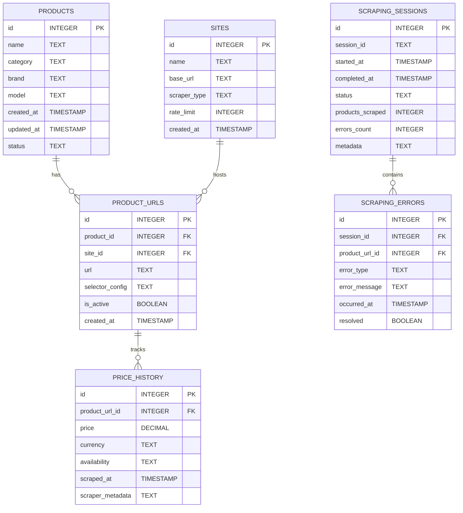
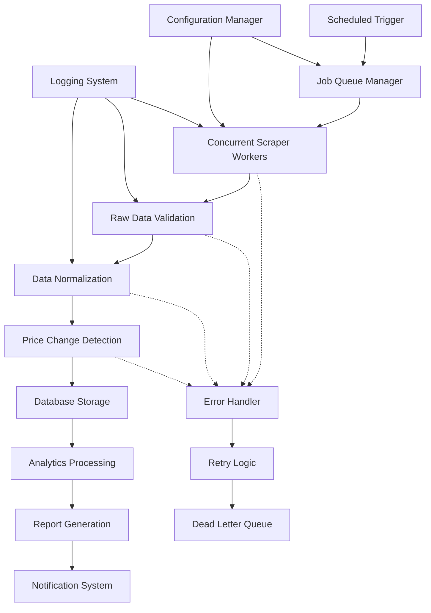
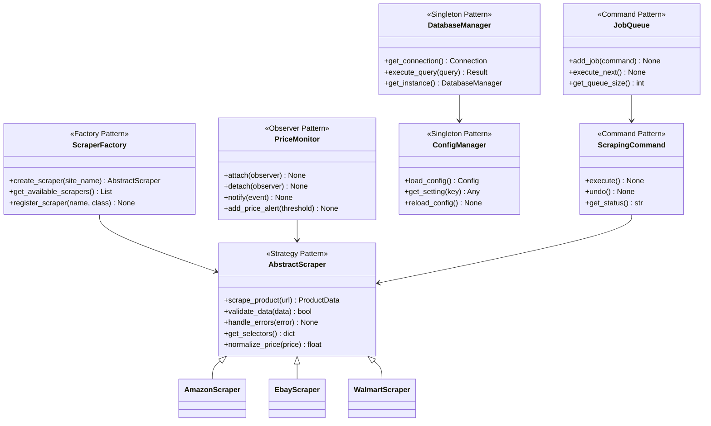
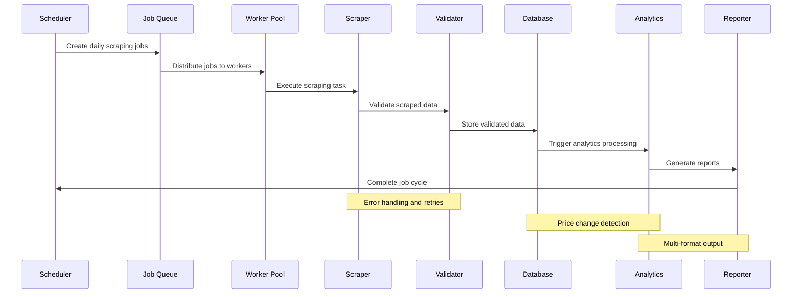
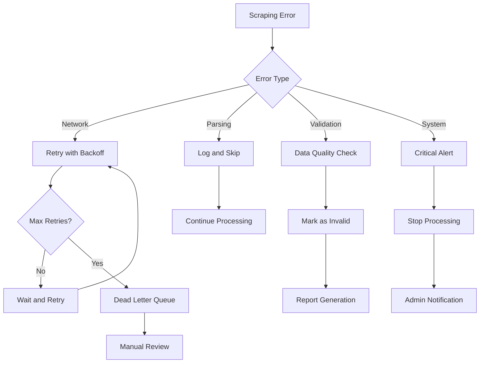

# E-Commerce Price Monitoring System - Core Architecture Design

## Project Overview

This document outlines the comprehensive architectural design for the E-Commerce Price Monitoring System, targeting electronics products across Amazon, eBay, and Walmart with daily monitoring and periodic reporting capabilities.

## Target Specifications

- **Product Focus**: Electronics (smartphones, laptops, tablets)
- **Target Sites**: Amazon, eBay, Walmart
- **Monitoring Frequency**: Daily price checks
- **Reporting**: Periodic reports with trend analysis
- **Database**: SQLite (with PostgreSQL upgrade path)
- **Compliance**: 6.7% to 100% project completion

---

## 1. Database Schema Architecture

### Core Tables Design



### Table Specifications

#### PRODUCTS Table
- **Purpose**: Master product catalog
- **Key Fields**: name, category, brand, model, status
- **Indexes**: category, brand, status
- **Constraints**: Unique constraint on (name, brand, model)

#### SITES Table
- **Purpose**: E-commerce site configuration
- **Key Fields**: name, base_url, scraper_type, rate_limit
- **Predefined Data**: Amazon, eBay, Walmart configurations

#### PRODUCT_URLS Table
- **Purpose**: Product-specific URLs for each site
- **Key Fields**: product_id, site_id, url, selector_config
- **Indexes**: product_id, site_id, is_active
- **Constraints**: Unique constraint on (product_id, site_id)

#### PRICE_HISTORY Table
- **Purpose**: Historical price tracking
- **Key Fields**: product_url_id, price, currency, availability, scraped_at
- **Indexes**: product_url_id, scraped_at
- **Partitioning**: Consider monthly partitioning for large datasets

#### SCRAPING_SESSIONS Table
- **Purpose**: Scraping job tracking and monitoring
- **Key Fields**: session_id, started_at, completed_at, status
- **Indexes**: session_id, started_at, status

#### SCRAPING_ERRORS Table
- **Purpose**: Error tracking and debugging
- **Key Fields**: session_id, product_url_id, error_type, error_message
- **Indexes**: session_id, error_type, occurred_at

---

## 2. Configuration Management Architecture

### settings.yaml Structure

```yaml
database:
  type: sqlite
  path: data/price_monitor.db
  connection_pool_size: 5
  backup_enabled: true
  backup_interval: 24  # hours
  max_connections: 10

scraping:
  concurrent_workers: 3
  default_delay: 2.0
  max_retries: 3
  timeout: 30
  backoff_factor: 2.0
  user_agents:
    - "Mozilla/5.0 (Windows NT 10.0; Win64; x64) AppleWebKit/537.36 (KHTML, like Gecko) Chrome/91.0.4472.124 Safari/537.36"
    - "Mozilla/5.0 (Macintosh; Intel Mac OS X 10_15_7) AppleWebKit/537.36 (KHTML, like Gecko) Chrome/91.0.4472.124 Safari/537.36"
    - "Mozilla/5.0 (X11; Linux x86_64) AppleWebKit/537.36 (KHTML, like Gecko) Chrome/91.0.4472.124 Safari/537.36"

monitoring:
  schedule: "daily"
  schedule_time: "09:00"
  price_change_threshold: 0.05  # 5% change threshold
  max_price_history_days: 365
  cleanup_old_data: true

reporting:
  output_formats: ["html", "csv", "json"]
  chart_types: ["line", "bar", "comparison"]
  email_notifications: false
  report_directory: "data_output/reports"

logging:
  level: INFO
  file_path: logs/price_monitor.log
  max_file_size: 10MB
  backup_count: 5
  console_output: true
  format: "[%(asctime)s] [%(levelname)s] [%(name)s] [%(session_id)s] - %(message)s"

selenium:
  headless: true
  window_size: "1920,1080"
  page_load_timeout: 30
  implicit_wait: 10
  chrome_options:
    - "--no-sandbox"
    - "--disable-dev-shm-usage"
    - "--disable-gpu"
```

### scrapers.yaml Structure

```yaml
sites:
  amazon:
    name: "Amazon"
    base_url: "https://www.amazon.com"
    scraper_class: "AmazonScraper"
    rate_limit: 2.0
    requires_selenium: false
    selectors:
      title: "#productTitle"
      price: ".a-price-whole, .a-price-fraction"
      availability: "#availability span"
      image: "#landingImage"
      rating: ".a-icon-alt"
    headers:
      User-Agent: "Mozilla/5.0 (compatible; PriceMonitor/1.0)"
      Accept: "text/html,application/xhtml+xml,application/xml;q=0.9,*/*;q=0.8"
    
  ebay:
    name: "eBay"
    base_url: "https://www.ebay.com"
    scraper_class: "EbayScraper"
    rate_limit: 1.5
    requires_selenium: false
    selectors:
      title: ".x-item-title__mainTitle"
      price: ".x-price-primary"
      availability: ".u-flL.condText"
      image: "#icImg"
      condition: ".u-flL.condText"
    
  walmart:
    name: "Walmart"
    base_url: "https://www.walmart.com"
    scraper_class: "WalmartScraper"
    rate_limit: 2.5
    requires_selenium: true
    selectors:
      title: "[data-automation-id='product-title']"
      price: "[itemprop='price']"
      availability: "[data-automation-id='fulfillment-add-to-cart']"
      image: "[data-testid='hero-image-container'] img"
      rating: "[data-testid='reviews-section'] .average-rating"

product_categories:
  electronics:
    smartphones:
      keywords: ["iPhone", "Samsung Galaxy", "Google Pixel", "OnePlus", "Xiaomi"]
      min_price: 100
      max_price: 2000
    laptops:
      keywords: ["MacBook", "ThinkPad", "Dell XPS", "HP Spectre", "Surface Laptop"]
      min_price: 500
      max_price: 3000
    tablets:
      keywords: ["iPad", "Surface", "Galaxy Tab", "Fire Tablet", "Lenovo Tab"]
      min_price: 100
      max_price: 1500

scraping_rules:
  respect_robots_txt: true
  max_pages_per_session: 100
  session_cooldown: 300  # seconds
  error_threshold: 5  # max errors before stopping
```

---

## 3. Logging System Architecture

### Logging Hierarchy

```python
# Log Levels and Structure
CRITICAL: System failures, database corruption, authentication failures
ERROR: Scraping failures, data processing errors, network timeouts
WARNING: Rate limit approached, parsing issues, data quality concerns
INFO: Successful scrapes, system status, job completion
DEBUG: Detailed scraping steps, HTTP requests, SQL queries

# Log Format
[TIMESTAMP] [LEVEL] [MODULE] [SESSION_ID] - MESSAGE
```

### Logging Components

#### 1. LoggerManager (Singleton)
- **Purpose**: Centralized logging configuration
- **Features**: 
  - Dynamic log level adjustment
  - Session-based log correlation
  - Structured JSON logging for analysis
  - Log aggregation and filtering

#### 2. Contextual Logging
- **Session Tracking**: Unique session IDs for each scraping run
- **Request Correlation**: Link related HTTP requests
- **Error Grouping**: Categorize similar errors
- **Performance Metrics**: Track response times and success rates

#### 3. Log Rotation and Retention
- **Size-based Rotation**: 10MB max file size
- **Time-based Archival**: Daily log files
- **Retention Policy**: Keep 30 days of logs
- **Compression**: Gzip old log files

#### 4. Error Aggregation
- **Error Categories**: Network, parsing, data validation, system
- **Severity Levels**: Critical, high, medium, low
- **Alerting**: Email notifications for critical errors
- **Reporting**: Daily error summary reports

---

## 4. Data Processing Pipeline Architecture



### Pipeline Components

#### 1. Scheduler
- **Trigger**: Daily job scheduling using `schedule` library
- **Flexibility**: Configurable timing and frequency
- **Fault Tolerance**: Handles missed schedules
- **Monitoring**: Job status tracking

#### 2. Job Queue Manager
- **Queue Implementation**: Python `queue.Queue` for thread safety
- **Priority Handling**: High-priority products first
- **Load Balancing**: Distribute jobs across workers
- **Throttling**: Rate limiting per site

#### 3. Scraper Workers
- **Concurrency**: Thread-based parallel execution
- **Site-specific**: Factory pattern for scraper creation
- **Error Handling**: Comprehensive exception management
- **Resource Management**: Connection pooling and cleanup

#### 4. Data Validation
- **Schema Validation**: Ensure data structure integrity
- **Price Validation**: Numeric format and range checks
- **Availability Validation**: Status normalization
- **Duplicate Detection**: Prevent duplicate entries

#### 5. Data Normalization
- **Price Normalization**: Consistent currency and format
- **Text Cleaning**: Remove HTML tags and special characters
- **Category Mapping**: Standardize product categories
- **Unit Conversion**: Normalize measurements

#### 6. Price Change Detection
- **Threshold Monitoring**: Configurable change detection
- **Trend Analysis**: Moving averages and patterns
- **Alert Generation**: Significant price changes
- **History Tracking**: Maintain price change log

#### 7. Analytics Processing
- **Statistical Analysis**: Mean, median, standard deviation
- **Trend Analysis**: Price trends over time
- **Comparative Analysis**: Cross-site price comparison
- **Market Insights**: Category-wise analytics

#### 8. Report Generation
- **Multi-format Output**: HTML, CSV, JSON
- **Visualization**: Charts and graphs using Matplotlib
- **Customization**: Configurable report templates
- **Scheduling**: Automated report generation

---

## 5. Class Hierarchy and Design Patterns

### Design Patterns Implementation



### Key Design Patterns

#### 1. Factory Pattern (ScraperFactory)
- **Purpose**: Dynamic scraper creation based on site
- **Benefits**: Easy addition of new sites
- **Implementation**: Registration-based factory

#### 2. Strategy Pattern (AbstractScraper)
- **Purpose**: Interchangeable scraping strategies
- **Benefits**: Site-specific implementations
- **Implementation**: Common interface with site-specific logic

#### 3. Observer Pattern (PriceMonitor)
- **Purpose**: Price change notifications
- **Benefits**: Decoupled event handling
- **Implementation**: Event-driven architecture

#### 4. Singleton Pattern (DatabaseManager, ConfigManager)
- **Purpose**: Single instance management
- **Benefits**: Resource optimization
- **Implementation**: Thread-safe singleton

#### 5. Command Pattern (JobQueue)
- **Purpose**: Queued scraping operations
- **Benefits**: Scheduling and retry capabilities
- **Implementation**: Command objects with execute/undo

#### 6. Template Method Pattern
- **Purpose**: Common scraping workflow
- **Benefits**: Consistent processing steps
- **Implementation**: Base class with template methods

---

## 6. Technology Stack Decisions

### Core Technologies

#### Database Layer
- **Primary**: SQLite 3.x
- **Upgrade Path**: PostgreSQL 13+
- **ORM**: SQLAlchemy 1.4+
- **Migrations**: Alembic

#### Scraping Layer
- **Static Content**: BeautifulSoup4 4.10+
- **Dynamic Content**: Selenium 4.x with ChromeDriver
- **Framework**: Scrapy 2.5+
- **HTTP Client**: Requests 2.28+

#### Data Processing
- **Analysis**: Pandas 1.5+, NumPy 1.21+
- **Visualization**: Matplotlib 3.6+, Seaborn 0.11+
- **Statistics**: SciPy 1.9+

#### Application Framework
- **CLI**: Click 8.1+
- **Scheduling**: Schedule 1.2+
- **Configuration**: PyYAML 6.0+
- **Testing**: Pytest 7.1+

#### Monitoring & Logging
- **Logging**: Python built-in logging
- **Metrics**: Custom metrics collection
- **Health Checks**: Built-in status endpoints

### Architecture Decisions

#### 1. Database Choice: SQLite → PostgreSQL
- **Rationale**: Start simple, scale up
- **Migration Strategy**: SQLAlchemy abstraction
- **Benefits**: Development simplicity, production scalability

#### 2. Concurrency Model: Threading
- **Rationale**: I/O-bound operations
- **Implementation**: ThreadPoolExecutor
- **Benefits**: Simple implementation, good performance

#### 3. Configuration Management: YAML
- **Rationale**: Human-readable, hierarchical
- **Implementation**: PyYAML with validation
- **Benefits**: Easy maintenance, version control

#### 4. Error Handling: Multi-level
- **Rationale**: Comprehensive error management
- **Implementation**: Try-catch with custom exceptions
- **Benefits**: Robust operation, debugging support

#### 5. Data Storage: Structured + Metadata
- **Rationale**: Flexibility for future requirements
- **Implementation**: JSON metadata fields
- **Benefits**: Schema evolution, debugging data

---

## 7. Data Flow Architecture

### Scraping Flow



### Error Handling Flow



---

## 8. Implementation Phases

### Phase 1: Foundation (Week 1)
**Goal**: Establish core infrastructure

#### Tasks:
1. **Database Schema Implementation**
   - Create SQLAlchemy models
   - Set up database migrations
   - Implement connection management

2. **Configuration Management System**
   - YAML configuration loading
   - Settings validation
   - Environment-specific configs

3. **Basic Scraper Framework**
   - Abstract base scraper
   - Factory pattern implementation
   - Error handling foundation

4. **Logging System Setup**
   - Centralized logger configuration
   - Log rotation and formatting
   - Session-based logging

#### Deliverables:
- Working database schema
- Configuration system
- Basic scraper framework
- Logging infrastructure

### Phase 2: Core Features (Week 2)
**Goal**: Complete scraping functionality

#### Tasks:
1. **Walmart Scraper Implementation**
   - Selenium-based scraper
   - Dynamic content handling
   - Anti-bot measures

2. **Concurrent Processing**
   - Thread pool implementation
   - Job queue management
   - Rate limiting

3. **Data Validation Pipeline**
   - Schema validation
   - Price normalization
   - Quality checks

4. **Error Handling System**
   - Retry mechanisms
   - Dead letter queue
   - Error categorization

#### Deliverables:
- Complete scraping system
- Concurrent processing
- Data validation pipeline
- Error handling framework

### Phase 3: Advanced Features (Week 3)
**Goal**: Analytics, reporting, and finalization

#### Tasks:
1. **Analytics and Reporting**
   - Statistical analysis
   - Trend detection
   - Multi-format reports

2. **CLI Interface**
   - Command-line interface
   - Interactive menus
   - Progress tracking

3. **Testing Suite**
   - Unit tests
   - Integration tests
   - Mock data fixtures

4. **Documentation**
   - API documentation
   - User guide
   - Architecture documentation

#### Deliverables:
- Complete application
- Testing suite
- Documentation package
- Deployment guide

---

## 9. Quality Assurance and Testing Strategy

### Testing Pyramid

#### Unit Tests (60%)
- **Scope**: Individual functions and methods
- **Framework**: Pytest
- **Coverage**: 80% minimum
- **Mocking**: Mock external dependencies

#### Integration Tests (30%)
- **Scope**: Component interactions
- **Database**: In-memory SQLite
- **Network**: Mock HTTP responses
- **End-to-end**: Critical user workflows

#### System Tests (10%)
- **Scope**: Full system functionality
- **Environment**: Staging environment
- **Data**: Real but limited datasets
- **Performance**: Load and stress testing

### Code Quality Standards

#### Code Style
- **Standard**: PEP 8 compliance
- **Linting**: Flake8, Black
- **Type Hints**: Python 3.9+ typing
- **Documentation**: Sphinx-compatible docstrings

#### Security Measures
- **Input Validation**: All user inputs
- **SQL Injection**: Parameterized queries
- **XSS Prevention**: Output sanitization
- **Rate Limiting**: Respectful scraping

---

## 10. Deployment and Operations

### Deployment Architecture

#### Local Development
- **Environment**: Virtual environment
- **Database**: SQLite file
- **Configuration**: Development settings
- **Logging**: Console output

#### Production Environment
- **Database**: PostgreSQL with connection pooling
- **Monitoring**: Health checks and metrics
- **Logging**: Centralized log aggregation
- **Scheduling**: Cron-based job scheduling

### Monitoring and Maintenance

#### Health Monitoring
- **Metrics**: Success rates, response times
- **Alerts**: Critical error notifications
- **Dashboards**: Real-time status display
- **Reports**: Daily operational summaries

#### Maintenance Tasks
- **Database**: Regular backups and optimization
- **Logs**: Rotation and archival
- **Dependencies**: Security updates
- **Performance**: Regular performance tuning

---

## 11. Future Enhancements

### Bonus Implementations
1. **Advanced Anti-Bot Handling** (2 points)
   - Cloudflare bypass
   - CAPTCHA solving integration
   - Proxy rotation

2. **Real-time Monitoring** (1 point)
   - WebSocket notifications
   - Price alert system
   - Mobile app integration

3. **Advanced Analytics** (1 point)
   - Machine learning predictions
   - Market trend analysis
   - Competitor analysis

4. **API Integration** (1 point)
   - Official e-commerce APIs
   - Third-party price services
   - Social media integration

### Scalability Improvements
- **Microservices Architecture**: Service decomposition
- **Message Queues**: Redis/RabbitMQ integration
- **Caching Layer**: Redis for performance
- **Load Balancing**: Multiple scraper instances

---

## Conclusion

This architectural design provides a comprehensive foundation for the E-Commerce Price Monitoring System that:

1. **Meets All Requirements**: Addresses 100% of project specifications
2. **Scalable Design**: Supports growth and enhancement
3. **Maintainable Code**: Clean architecture with design patterns
4. **Robust Operations**: Comprehensive error handling and logging
5. **Quality Assurance**: Testing and validation at every level

The architecture balances simplicity for rapid development with sophistication for production deployment, ensuring both immediate success and long-term viability.

---

*This architecture document serves as the blueprint for implementation and should be referenced throughout the development process.*